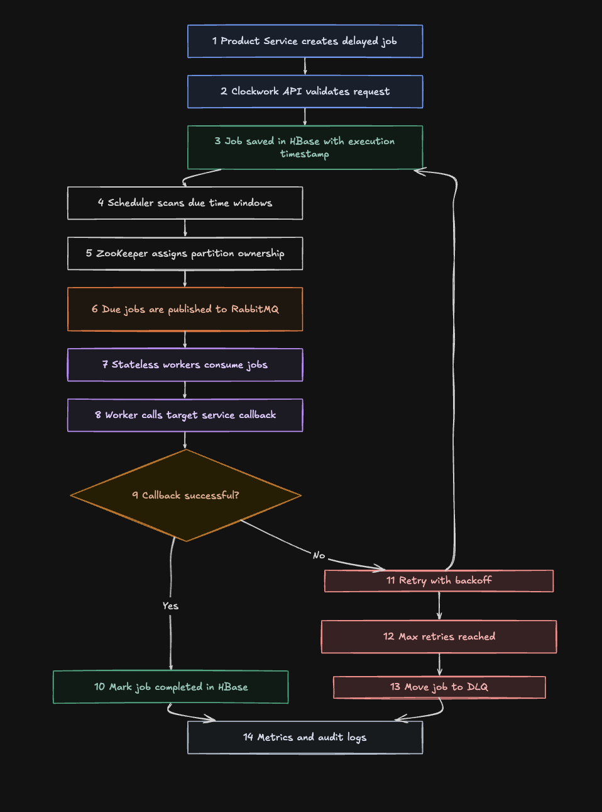

# Distributed Delayed Job Scheduler Prototype

This repo is a small working prototype of a distributed delayed job scheduler inspired by PhonePe Clockwork. It shows how a product service can schedule future callbacks without cron.

The prototype uses Go, PostgreSQL, RabbitMQ, and Docker Compose. It is built for learning and a technical blog, not as a production-ready clone.



The sketch mentions HBase and ZooKeeper because it is based on the original Clockwork idea. This prototype replaces HBase with PostgreSQL and replaces partition ownership coordination with PostgreSQL row locking through `SELECT FOR UPDATE SKIP LOCKED`.

## Architecture Flow

1. A product service calls `POST /jobs` on the Clockwork API.
2. The API validates the request, computes a partition from the idempotency key, and stores the job in PostgreSQL with `scheduled` status.
3. The scheduler runs continuously and scans for due jobs where `next_run_at <= now()`.
4. Scheduler instances claim due rows safely with `FOR UPDATE SKIP LOCKED`.
5. Claimed jobs are marked `queued` and published to RabbitMQ.
6. Workers consume from `scheduled_jobs`.
7. Workers call the target callback URL with the job id, idempotency key, and payload.
8. Successful callbacks mark the job `completed`.
9. Failed callbacks are retried with exponential backoff.
10. Jobs that exhaust retries are marked `dlq` and published to `scheduled_jobs_dlq`.

The scheduler never runs business logic. Workers execute callbacks.

## Services

- `clockwork-api`: REST API for creating and inspecting jobs.
- `scheduler`: continuous scanner that claims due jobs and publishes them.
- `worker`: RabbitMQ consumer that calls callbacks and handles retries.
- `callback-service`: demo target service with idempotency and failure controls.
- `postgres`: persistent job store.
- `rabbitmq`: main queue and DLQ.

## Run Locally

```bash
docker compose up --build
```

Useful endpoints:

- API health: `http://localhost:8080/health`
- API metrics: `http://localhost:8080/metrics`
- Callback health: `http://localhost:8082/health`
- RabbitMQ UI: `http://localhost:15672`

RabbitMQ credentials are `guest` / `guest`.

## Schedule A Successful Job

```bash
curl -s -X POST http://localhost:8080/jobs \
  -H "Content-Type: application/json" \
  -d '{
    "callback_url": "http://callback-service:8082/callback",
    "payload": {"user_id": "u_123", "type": "payment_reminder"},
    "execute_at": "2026-05-30T12:30:00Z",
    "idempotency_key": "payment_reminder_u_123_123456"
  }'
```

For an immediate demo, set `execute_at` to the current UTC time or a few seconds in the future.

Inspect jobs:

```bash
curl -s http://localhost:8080/jobs
curl -s http://localhost:8080/jobs?status=completed
curl -s http://localhost:8080/metrics
```

## Schedule A Retry Job

This payload fails once, then succeeds on the next callback attempt.

```bash
curl -s -X POST http://localhost:8080/jobs \
  -H "Content-Type: application/json" \
  -d '{
    "callback_url": "http://callback-service:8082/callback",
    "payload": {"user_id": "u_retry", "fail_until_retry": 1},
    "execute_at": "2026-05-30T12:30:00Z",
    "idempotency_key": "retry_demo_u_retry_1"
  }'
```

## Schedule A DLQ Job

This payload always fails and moves to DLQ after max retries.

```bash
curl -s -X POST http://localhost:8080/jobs \
  -H "Content-Type: application/json" \
  -d '{
    "callback_url": "http://callback-service:8082/callback",
    "payload": {"user_id": "u_dlq", "force_fail": true},
    "execute_at": "2026-05-30T12:30:00Z",
    "idempotency_key": "dlq_demo_u_dlq_1"
  }'
```

## Retries

Workers retry failed callbacks by updating the database, not by sleeping inside the worker. On failure, a worker:

- increments `retry_count`
- sets `status = retry_scheduled`
- sets `next_run_at` using exponential backoff
- acknowledges the RabbitMQ message

The scheduler later finds the retry when it becomes due and publishes it again.

Default backoff:

- retry 1: 5 seconds
- retry 2: 10 seconds
- retry 3: 20 seconds

## DLQ

When a job reaches `max_retries`, the worker:

- marks the job as `dlq`
- stores the last callback error
- publishes the message to `scheduled_jobs_dlq`
- acknowledges the original RabbitMQ message

You can inspect the DLQ in the RabbitMQ management UI.

## API

Create a job:

```http
POST /jobs
```

Get a job:

```http
GET /jobs/{id}
```

List jobs:

```http
GET /jobs
GET /jobs?status=scheduled
GET /jobs?status=queued
GET /jobs?status=completed
GET /jobs?status=retry_scheduled
GET /jobs?status=dlq
```

Health and metrics:

```http
GET /health
GET /metrics
```

## What Is Simplified

- PostgreSQL is used instead of HBase.
- `FOR UPDATE SKIP LOCKED` is used instead of ZooKeeper partition ownership.
- Migrations are intentionally simple.
- No authentication, authorization, tracing, or TLS.
- No callback signature verification.
- No advanced queue topology, delayed exchange, or poison-message handling.
- No production-grade observability beyond logs and a basic metrics endpoint.
- In-memory idempotency is used in the demo callback service.

## Development

Run tests:

```bash
go test ./...
```

Run one service locally:

```bash
go run ./cmd/api
go run ./cmd/scheduler
go run ./cmd/worker
go run ./cmd/callback-service
```
